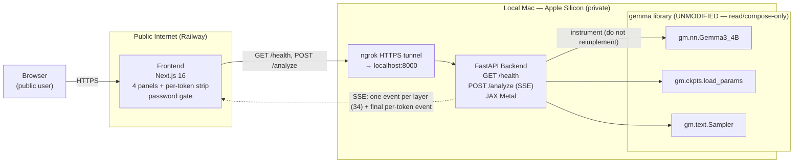

# Gemma Compute Monitor

> Real-time, per-transformer-layer compute and memory telemetry for a locally
> running **Gemma 3 4B** model, streamed to a public web dashboard.

The **Gemma Compute Monitor** is a self-contained product layered on top of the
existing [`google-deepmind/gemma`](https://github.com/google-deepmind/gemma) JAX
library that lives in this repository under [`gemma/`](./gemma). It is the single
entry-point you need to stand up the whole system end to end. For deeper,
per-component detail, follow the cross-links to the component READMEs:

- **Backend deep dive:** [`backend/README.md`](./backend/README.md)
- **Frontend deep dive:** [`frontend/README.md`](./frontend/README.md)

## Table of Contents

- [Overview](#overview)
  - [Components](#components)
- [Architecture](#architecture)
- [Prerequisites](#prerequisites)
- [Backend Setup](#backend-setup)
- [Frontend Setup and Live Railway Deployment](#frontend-setup-and-live-railway-deployment)
- [Per-Session ngrok Workflow](#per-session-ngrok-workflow)
- [Environment Variable Contract](#environment-variable-contract)
- [API Contracts](#api-contracts)
- [Color Palette](#color-palette)
- [Troubleshooting](#troubleshooting)

## Overview

The Gemma Compute Monitor is a publicly accessible web application that
visualizes, in real time, the per-layer compute and memory cost of a **Gemma 3
4B** forward pass running locally on Apple Silicon. As the model processes a
prompt, the backend emits one telemetry event after **each transformer layer**
— one event per layer (**34 for Gemma 3 4B**), plus one final per-token event —
and the frontend animates that stream across four live panels and a per-token
compute-cost strip.

> **Core principle — instrument, never reimplement.** The `gemma` library is
> used *as-is* and only **instrumented**: model loading, tokenization, and the
> transformer forward pass are **never reimplemented**. The product composes
> gemma purely through the canonical idiom `from gemma import gm`
> (`gm.nn.Gemma3_4B`, `gm.ckpts.load_params`, `gm.text.Sampler`). The entire
> `gemma/**` tree is **read/compose-only and is never modified** by this
> product.

### Components

The product comprises two independently deployed components:

- **Backend** ([`backend/`](./backend)) — a local **FastAPI** application that
  runs on a MacBook Pro with Apple Silicon (M-series, 48 GB unified memory,
  macOS 14+) using the **JAX Metal** backend. It loads Gemma 3 4B **once** at
  startup, instruments the model's forward pass to emit one telemetry event
  after each transformer layer, and streams those events to the browser over
  **Server-Sent Events (SSE)**. The backend always runs **locally** on the Mac.

- **Frontend** ([`frontend/`](./frontend)) — a **Next.js 16** application
  deployed to a live, public **Railway** URL. It connects to the local backend
  through an **ngrok HTTPS tunnel**, visualizes the telemetry across **four
  animated panels plus a final per-token compute-cost strip**, and gates access
  behind a single shared password. The frontend is **public**.

## Architecture

The frontend is reached publicly on Railway; it forwards requests through an
ngrok HTTPS tunnel to the FastAPI backend running locally on the Mac, which in
turn **composes the unmodified `gemma` library** to load the model, run the
instrumented forward pass, and sample tokens.



## Prerequisites

Make sure the following are in place before you begin.

- **Hardware** — MacBook Pro with **Apple Silicon** (M-series). **48 GB unified
  memory** is recommended: the Gemma 3 4B weights occupy roughly 8.5 GB and share
  the same unified-memory pool as the OS, KV cache, and activations. **macOS 14+**.
- **Python >= 3.12** — Required and governed by gemma's
  `requires-python = ">=3.12"` (declared in the repository's
  [`pyproject.toml`](./pyproject.toml)). The backend virtual environment **must**
  target Python 3.12 or newer.
- **Node.js 20 LTS** — Required for the **Next.js 16** frontend (Turbopack is the
  default bundler, paired with React 19.2).
- **Gemma 3 4B checkpoint** — Download the Gemma 3 4B weights locally and supply
  the path via the `GEMMA_WEIGHTS_PATH` environment variable. See the gemma
  checkpoint documentation: [`docs/checkpoints.md`](./docs/checkpoints.md).
- **ngrok CLI** — Installed and authenticated. It provides the per-session
  **HTTPS tunnel** that exposes the local backend (port **8000**) to the public
  Railway frontend.
- **Railway account** — Required to deploy the frontend to a live, public URL.
- **`powermetrics`** — A **built-in macOS utility** used for Metal GPU
  utilization, but it **requires root**. Without elevated privileges the GPU
  metric (`gpu_pct`) falls back to `0.0` — this is **expected** and is the
  practical default.

## Backend Setup

> **The dependency install ORDER matters.** The Metal JAX backend is
> **version-lock sensitive**, so the steps below must be performed in exactly the
> order shown. **`jax-metal` must never be upgraded without explicit user
> approval.**

Run the following from the repository root, in **exactly** this order:

```sh
# 1. Create and activate a Python 3.12 virtual environment.
python3.12 -m venv .venv
source .venv/bin/activate

# 2. Install the Metal backend FIRST (order matters — version-lock sensitive).
#    jax/jaxlib 0.5.0 is the highest jax-metal==0.1.1-compatible version (0.4.25
#    was too old: the Metal PJRT plugin needs jaxlib>=0.4.34). Keep them equal.
pip install jax-metal==0.1.1
pip install jaxlib==0.5.0 jax==0.5.0

# 3. Install the web stack (quote the bracketed extra so zsh does not glob it).
#    fastapi 0.136.3 pulls a FIXED Starlette; the old 0.111.0 forced the
#    vulnerable starlette 0.37.2.
pip install fastapi==0.136.3 'uvicorn[standard]==0.49.0' sse-starlette==3.4.4 psutil==7.2.2

# 4. Install gemma — used AS-IS (portable PyPI pin, resolves from any directory).
pip install gemma==4.0.1   # or, for in-repo dev: pip install -e . (from repo root)

# 5. Point GEMMA_WEIGHTS_PATH at your local Gemma 3 4B Orbax checkpoint.
export GEMMA_WEIGHTS_PATH="/path/to/gemma-3-4b/checkpoint"

# 6. Run the server (from inside backend/).
cd backend
uvicorn app.main:app --host 0.0.0.0 --port 8000
```

All exact pins are also captured in [`backend/requirements.txt`](./backend/requirements.txt),
and the environment template lives in
[`backend/.env.example`](./backend/.env.example). For the full per-component deep
dive, see [`backend/README.md`](./backend/README.md).

> **⚠️ Compatibility warning (primary dependency risk — RESOLVED).**
> `jax-metal==0.1.1` is only compatible with **older** jax/jaxlib, while **gemma
> 4.0.1 depends on an *unpinned, modern* JAX**. The original `jaxlib==0.4.25` pin
> was **too old** for `jax-metal==0.1.1` (the Metal PJRT plugin requires
> `jaxlib>=0.4.34`), making the macOS-arm64 install unsatisfiable. Per AAP §0.7.2
> this is resolved by pinning **`jax==0.5.0` / `jaxlib==0.5.0`** (step 2 above):
>
> 1. `0.5.0` is the **highest** `jax-metal==0.1.1`-compatible version
>    (community-verified; `0.5.1+` break `jax-metal 0.1.1`). Keep `jax` and
>    `jaxlib` equal — they are released in lockstep.
> 2. `jax==0.5.0` satisfies gemma 4.0.1's bare `jax` dependency, so the full
>    backend set resolves on macOS arm64 / Python 3.12.
> 3. If a future gemma release ever needs a JAX newer than `0.5.0`, optionally
>    set `ENABLE_PJRT_COMPATIBILITY=1` and **escalate to the user before changing
>    `jax-metal`** — never silently upgrade it.
>
> **No CUDA / `jax[cuda]` may ever appear in the dependency tree.** Only the
> Apple-Silicon Metal JAX backend is permitted.

### What happens at startup

When the server boots, a FastAPI **lifespan hook** performs the **one-time**
model load:

```python
model  = gm.nn.Gemma3_4B(text_only=True)
params = gm.ckpts.load_params(GEMMA_WEIGHTS_PATH, text_only=True)
```

It then flips an internal readiness flag from `loading` → `ready`. Passing
`text_only=True` **strips the default SigLiP vision encoder**, since this is a
text-only telemetry workload. While the model is still `loading`, `POST /analyze`
returns **`503`** (see [API Contracts](#api-contracts)).

## Frontend Setup and Live Railway Deployment

### Local development

From the [`frontend/`](./frontend) directory:

```sh
cd frontend
npm install
npm run dev
```

This runs the **Next.js 16** dev server on **Node.js 20**. The dashboard uses
**no third-party charting libraries**: the Layer Activity bar chart and the
memory/gauge panels are rendered with **CSS/SVG**, and the GPU Utilization
waveform is a native HTML **`<canvas>`** driven by **`requestAnimationFrame`** so
SSE updates never block the main thread.

### Required frontend environment variables

These are also documented in [`frontend/.env.example`](./frontend/.env.example):

- `NEXT_PUBLIC_API_URL` — the **ngrok HTTPS URL** of the local backend.
- `NEXT_PUBLIC_PASSWORD` — the **shared password** for the access gate.

### Live Railway deployment (mandatory)

**Live deployment is mandatory** — the frontend must be deployed to a live,
clickable **Railway** URL using [`frontend/railway.json`](./frontend/railway.json):

1. **Connect the repository to Railway** and point the service at the
   `frontend/` directory.
2. **Set the environment variables** `NEXT_PUBLIC_API_URL` (your current ngrok
   HTTPS URL) and `NEXT_PUBLIC_PASSWORD` in the Railway project.
3. **Deploy.**

> **Deployment status: BUILD- AND RUNTIME-VERIFIED, READY TO PUBLISH.**
> The Railway deployment artifact has been verified end to end:
> - `npm run build` (the Railway `buildCommand`) compiles cleanly with
>   **Next.js 16** — TypeScript passes and the static pages are generated.
> - `npm run start` (the Railway `startCommand`) serves the app on the
>   container `PORT`, and a local run confirmed it renders the **password gate**
>   (the dashboard stays hidden until the shared password is entered) using the
>   exact dark palette.
> - [`frontend/railway.json`](./frontend/railway.json) is valid (NIXPACKS
>   builder, `npm install && npm run build` build, `npm run start` start) and
>   [`package.json`](./frontend/package.json) declares `engines.node >= 20.9.0`.
>
> **Publishing the live URL is the final operator step and requires
> credentials this repository does not (and must not) contain** — a **Railway
> account/token** to host the frontend and a reachable backend (your local
> Apple-Silicon Mac exposed via **ngrok**) for it to stream telemetry. Run the
> publish from a machine that holds those credentials:
>
> ```sh
> # one-time: authenticate and link the Railway project
> npm i -g @railway/cli      # or: brew install railway
> railway login
> railway link               # select/create the project; service root = frontend/
>
> # set the build-time public env vars, then deploy
> railway variables --set NEXT_PUBLIC_API_URL="https://<your-ngrok-id>.ngrok-free.app" \
>                    --set NEXT_PUBLIC_PASSWORD="<your-shared-password>"
> railway up                 # builds with railway.json and returns the live URL
> ```
>
> (Equivalently, use the Railway dashboard: connect the repo, point the service
> at `frontend/`, set the same two variables, and Deploy.)
>
> **Record the live, clickable Railway URL on the line below once published**
> so this document always links to the running deployment:
>
> _Live URL: `https://<your-app>.up.railway.app`  (replace with the real URL printed by `railway up` / shown in the Railway dashboard)_

Because `NEXT_PUBLIC_API_URL` is a **build-time** variable in Next.js, any change
to the backend's ngrok URL requires a Railway **redeploy** — see the
[Per-Session ngrok Workflow](#per-session-ngrok-workflow) below. For the full
per-component deep dive, see [`frontend/README.md`](./frontend/README.md).

## Per-Session ngrok Workflow

The backend runs locally and is reached through an ngrok tunnel whose HTTPS URL
**changes each session**. At the start of **every** backend session, perform
these three steps:

1. Run `ngrok http 8000` and copy the HTTPS URL.
2. Update `NEXT_PUBLIC_API_URL` in the Railway environment variables.
3. Trigger a Railway redeploy.

**Why this is required:** the public Railway frontend cannot reach `localhost`,
so each backend session must be exposed via ngrok and the new HTTPS URL
propagated to Railway. Because `NEXT_PUBLIC_API_URL` is a **build-time**
variable, the redeploy is what **bakes the new value** into the `NEXT_PUBLIC_`
build — without it the frontend keeps using the previous (now-dead) tunnel URL.

## Environment Variable Contract

| Variable | Component | Description |
| --- | --- | --- |
| `GEMMA_WEIGHTS_PATH` | Backend | Local filesystem path to the Gemma 3 4B Orbax checkpoint. |
| `NEXT_PUBLIC_API_URL` | Frontend | The backend's public **ngrok HTTPS URL**. |
| `NEXT_PUBLIC_PASSWORD` | Frontend | The shared password, compared **client-side** against the value stored in `localStorage` by the password gate. |

> **CORS.** The backend's CORS policy **explicitly allows the Railway origin**,
> plus permissive origins for local development. The `NEXT_PUBLIC_*` variables
> are exposed to the browser at build time and are **not** secrets — the single
> password gate is a lightweight access control, not backend authentication.

## API Contracts

The following four JSON contracts are **immutable** — they must not drift between
the backend and the frontend. Reproduce them byte-for-byte.

**SSE layer event** (emitted once after each transformer layer):

```
{ layer: int, gpu_pct: float, cpu_pct: float, memory_used_gb: float, kv_cache_gb: float, activation_gb: float, elapsed_ms: float }
```

**SSE final event** (terminates the stream):

```
{ per_token_ms: float[], done: true }
```

**`POST /analyze` request body:**

```
{ prompt: string }
```

**`GET /health` response:**

```
{ status: "ready" | "loading", model: "gemma-3-4b" }
```

### Endpoint behavior

- **`GET /health`** reports readiness, returning `status: "ready"` once the model
  is loaded or `status: "loading"` while it is still warming up.
- **`POST /analyze`** returns a **Server-Sent Events** stream of **one event per
  transformer layer** — **34 for Gemma 3 4B**, derived **dynamically** from the
  loaded model configuration (`config.num_layers`) and **never hardcoded** —
  terminated by the final `{ per_token_ms, done: true }` event.
- While the model is still loading, `POST /analyze` returns **`503`**.
- A **second concurrent `POST /analyze` is rejected with `HTTP 429`** — a
  single-flight guard ensures **exactly one analysis runs at a time**.

## Color Palette

The dashboard is **dark-only** — **there is no light mode**. The following
seven-color palette is **non-negotiable** and fixed:

```
Background #0f1117 | Panels #1e2130 | Borders #2d3348
Primary accent #6366f1 | Secondary accent #8b5cf6
Healthy/active #10b981 | Layer counter #f59e0b
```

| Role | Hex |
| --- | --- |
| Background | `#0f1117` |
| Panels | `#1e2130` |
| Borders | `#2d3348` |
| Primary accent | `#6366f1` |
| Secondary accent | `#8b5cf6` |
| Healthy / active | `#10b981` |
| Layer counter | `#f59e0b` |

### How the palette maps to the four panels

- **Layer Activity Bar Chart** — the just-completed bar is highlighted in the
  primary accent `#6366f1`; previously completed bars dim to **40% opacity**; the
  active layer counter uses `#f59e0b`.
- **Unified Memory Breakdown** — uses the healthy accent `#10b981` for the
  aggregate against the 48 GB unified-memory pool.
- **GPU Utilization Waveform** — a scrolling HTML `<canvas>` drawn over the dark
  background.
- **Per-Token Compute Cost** — a strip rendered **only after the `done: true`
  event** arrives, one chip per generated token.

## Troubleshooting

### Frontend resilience messages

The dashboard surfaces two resilience messages (reproduced here verbatim):

- On a `/health` timeout or error, the UI shows:
  > Backend offline — start the local server and update the ngrok URL in Railway
- If `/analyze` does not begin streaming within 5 seconds, the UI shows:
  > Model warming up, this may take 20–40 seconds on first run.

### Common issues

- **GPU shows 0%.** `powermetrics` requires **root**; without `sudo` privileges
  the `gpu_pct` metric falls back to `0.0` (the subprocess uses a **200 ms
  timeout**). This is **expected** unless the backend runs elevated.
- **`jax-metal` / jaxlib import or load failures.** This is the version-lock
  issue. Do **not** upgrade `jax-metal`. Pin jax/jaxlib to the highest
  `jax-metal==0.1.1`-compatible version (approximately `0.5.0`), optionally set
  `ENABLE_PJRT_COMPATIBILITY=1`, and **escalate to the user** before changing
  `jax-metal`. Never add CUDA / `jax[cuda]` to the dependency tree.
- **Frontend can't reach the backend.** Verify that ngrok is running, that
  `NEXT_PUBLIC_API_URL` matches the **current** ngrok HTTPS URL, and that a
  Railway **redeploy** was triggered after updating it (see the
  [Per-Session ngrok Workflow](#per-session-ngrok-workflow)).
- **First request is slow.** The model loads at startup (**20–40 s on first
  run**). `/health` returns `loading` until ready, and `/analyze` returns `503`
  during that window.
- **Layer-count expectation (34, not 18).** Gemma 3 4B has **34** transformer
  layers, so the dashboard renders one bar and emits one event per layer — **34**
  in total for this model. If you were expecting the count to be 18, that value
  belongs to Gemma 2B / Gemma 3 270M, not Gemma 3 4B. The bar count is derived
  dynamically from the model's true `config.num_layers` (34), never a hardcoded
  constant.

---

*The `gemma/**` library in this repository is **read/compose-only** and is never
modified by the Gemma Compute Monitor. This product instruments gemma; it does
not reimplement model loading, tokenization, or the forward pass.*
