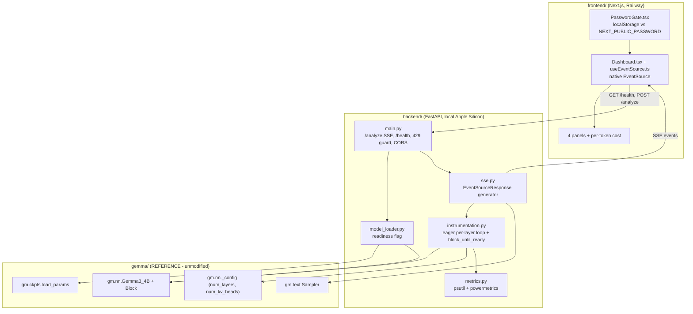

# Technical Specification

# 0. Agent Action Plan

## 0.1 Intent Clarification

### 0.1.1 Core Feature Objective

Based on the prompt, the Blitzy platform understands that the new feature requirement is to build a **new, self-contained product named "Gemma Compute Monitor"** layered on top of the already-ingested `google-deepmind/gemma` library [gemma/gm/__init__.py] without altering that library's source. The product is a publicly accessible web application that streams per-transformer-layer CPU/GPU/memory telemetry from a locally running Gemma 3 4B model to a deployed frontend in real time. It comprises two independently deployed components:

- A **local FastAPI backend** running on Apple Silicon with the JAX Metal backend, which loads Gemma 3 4B at startup, instruments its forward pass to emit a telemetry event after each transformer layer, and streams those events over Server-Sent Events (SSE).
- A **Railway-deployed Next.js frontend** that connects to the backend (through an ngrok HTTPS tunnel), visualizes the telemetry across four animated panels plus a final per-token compute-cost display, and gates access behind a single shared password.

The following discrete feature requirements are restated with enhanced technical clarity:

- **Startup model loading with readiness gating** — The model loads once during FastAPI startup; the server must refuse `/analyze` until the model is fully loaded, returning a `503` with a `loading` status until ready.
- **Per-layer instrumented forward pass** — The Gemma 3 4B forward pass is instrumented at every transformer-layer boundary; one telemetry event is emitted after each layer, and only after that layer's GPU work has been synchronized (no speculative or pre-emitted events).
- **SSE telemetry streaming** — `POST /analyze` returns an SSE stream of layer events terminated by a final per-token event; `GET /health` reports readiness.
- **System metrics collection** — `psutil` provides CPU percentage and RAM usage; a `powermetrics` subprocess provides Metal GPU utilization, with a 200 ms timeout and a `0.0` fallback when unavailable.
- **Four real-time visualization panels plus per-token cost** — Layer Activity Bar Chart, Unified Memory Breakdown, GPU Utilization Waveform, and a Per-Token Compute Cost strip rendered after completion.
- **Single-password frontend authentication** — A `localStorage`-backed password gate compared against an environment variable.
- **Live public deployment** — The frontend is deployed to a live, clickable Railway URL, reachable from the local backend via a per-session ngrok tunnel.

**Implicit requirements** surfaced by the Blitzy platform that are necessary but not explicitly enumerated:

- A FastAPI **lifespan/startup hook** that performs the one-time model load and maintains a `loading` → `ready` readiness flag consumed by both `/health` and `/analyze`.
- A **single-flight concurrency guard** (an `asyncio` lock or in-flight boolean) so a second concurrent `/analyze` is rejected with `HTTP 429` while one request is in flight.
- **SSE backpressure and client-disconnect handling**, so the generator stops cleanly when the browser closes the `EventSource`.
- An **explicit CORS allow-list** naming the Railway origin, with permissive origins for local development.
- A **dynamically derived layer count** sourced from the loaded model configuration rather than a hardcoded constant (see §0.1.2 for the critical layer-count clarification).
- A **non-blocking render path** on the frontend (`requestAnimationFrame` for canvas drawing) so SSE updates never stall the main thread.
- A documented **environment-variable contract**: `GEMMA_WEIGHTS_PATH` (backend), `NEXT_PUBLIC_API_URL` and `NEXT_PUBLIC_PASSWORD` (frontend).

**Feature dependencies and prerequisites** — The product depends entirely on the existing gemma library for model definition, checkpoint loading, tokenization, and the transformer forward pass; the prompt mandates these be used as-is and instrumented, never reimplemented. The gemma library is the official Google DeepMind JAX library, published to PyPI as version 4.0.1 (released 2026-05-20) under Apache 2.0, and already documented in this specification's executive summary and feature catalog.

### 0.1.2 Special Instructions and Constraints

The following directives are captured exactly as emphasized in the prompt and are binding on the implementation:

- **Instrument, do not reimplement** — "MUST use its checkpoint loading utilities and transformer architecture as-is; do NOT reimplement model loading, tokenization, or the forward pass — instrument only." The gemma library at `gemma/**` is read/compose-only.
- **No CUDA anywhere** — "CUDA MUST NOT appear anywhere in the dependency tree." Only the Metal JAX backend is permitted.
- **Maintain backward compatibility with existing architecture** — Integration occurs purely through `from gemma import gm` imports and composition [gemma/gm/__init__.py]; no gemma file is edited.
- **Immutable interface contracts** — The four JSON contracts below must be preserved exactly. These are reproduced verbatim from the prompt:

```
User-Specified SSE layer event:
{ layer: int, gpu_pct: float, cpu_pct: float, memory_used_gb: float,
  kv_cache_gb: float, activation_gb: float, elapsed_ms: float }

User-Specified SSE final event:
{ per_token_ms: float[], done: true }

User-Specified POST /analyze request body:
{ prompt: string }

User-Specified GET /health response:
{ status: "ready" | "loading", model: "gemma-3-4b" }
```

- **Non-negotiable color palette** (dark-themed, minimal, no light mode), reproduced verbatim:

```
User-Specified palette:
Background #0f1117 | Panels #1e2130 | Borders #2d3348
Primary accent #6366f1 | Secondary accent #8b5cf6
Healthy/active #10b981 | Layer counter #f59e0b
```

- **Strict backend dependency install order** — Metal JAX is version-lock sensitive; the install order and pins must be honored, and "NEVER upgrade jax-metal without explicit user approval."
- **Per-session ngrok workflow and live URL** — The deployment must produce a live clickable URL; the per-session workflow is preserved verbatim in §0.5.3.
- **Web search requirements** — The prompt's design names specific external technologies (`powermetrics`, `jax.effects_barrier()`, `sse-starlette`, Next.js latest stable) that required verification research; the findings are documented in §0.2.2.

**Critical clarifications and conflicts requiring resolution.** During repository reconnaissance the Blitzy platform detected several factual conflicts between the prompt's assumptions and the ingested gemma source. Each is flagged here and resolved in §0.7:

- **Layer count (highest-impact):** The prompt repeatedly assumes "18 transformer layers / 18 bars / exactly 18 events." The ingested source defines `_NUM_LAYERS_GEMMA3_4B = 34` [gemma/gm/nn/_gemma.py:L34]; the value 18 corresponds instead to `_NUM_LAYERS_GEMMA_2B` [gemma/gm/nn/_gemma.py:L27] and `_NUM_LAYERS_GEMMA3_270M` [gemma/gm/nn/_gemma.py:L32]. Gemma 3 4B has **34** transformer layers. Resolution: derive the layer count dynamically from the loaded configuration and parameterize the frontend bars and test assertions to the model's true layer count.
- **Python version:** The prompt states "Python 3.10+", but gemma declares `requires-python = ">=3.12"` [gemma/pyproject.toml:requires-python], corroborated by CI on Python 3.12 and docs on 3.13. The stricter `>=3.12` requirement governs.
- **JAX version tension:** The prompt pins `jax-metal==0.1.1` and `jaxlib==0.4.25` (early 2024), whereas gemma 4.0.1 depends on an unpinned, modern JAX [gemma/pyproject.toml:dependencies]. This is a high-risk incompatibility, addressed in §0.3 and §0.7.
- **KV-cache head count:** The prompt's KV-cache formula uses `num_heads`; the architecturally correct value for Gemma 3 4B is `num_kv_heads=4` (grouped-query attention), not `num_heads=8` [gemma/gm/nn/_gemma.py:§Gemma3_4B].
- **Synchronization primitive:** `jax.effects_barrier()` is a real JAX API but targets ordered side-effects; the correct barrier to force per-layer device computation to complete is `jax.block_until_ready(x)` on each layer output. The prompt explicitly allows "or equivalent Metal-compatible sync," which this satisfies.

### 0.1.3 Technical Interpretation

These feature requirements translate to the following technical implementation strategy, mapping each goal to concrete actions:

- To **serve telemetry without touching gemma**, we will create a new FastAPI application under `backend/` exposing `POST /analyze` (SSE) and `GET /health`, importing gemma purely as a dependency.
- To **load the model once and gate readiness**, we will create a model loader that builds `gm.nn.Gemma3_4B(text_only=True)` and calls `gm.ckpts.load_params(GEMMA_WEIGHTS_PATH, text_only=True)` [gemma/gm/ckpts/_checkpoint.py:L202-L211], wired into a FastAPI lifespan hook that flips a `loading` → `ready` flag.
- To **obtain per-layer telemetry despite the whole-model JIT compilation**, we will create an instrumentation harness that reuses the existing `Block` submodules [gemma/gm/nn/_modules.py:L395] and loaded weights but drives the per-layer loop eagerly — mirroring `Transformer._apply_attention` [gemma/gm/nn/_transformer.py:L293-L301] outside the `nn.jit` boundary [gemma/gm/nn/_transformer.py:L174] — calling `jax.block_until_ready(x)` after each block before sampling metrics and emitting an event.
- To **measure GPU utilization**, we will create a metrics module that invokes `powermetrics --samplers gpu_power` as a subprocess with a 200 ms timeout, parsing GPU active residency and falling back to `0.0`, alongside `psutil` for CPU and RAM.
- To **estimate memory**, we will compute `kv_cache_gb` from the loaded configuration (`num_kv_heads`, `head_dim`, `num_layers`) and `activation_gb` from intermediate tensor shapes, treating model weights (~8.5 GB) as static.
- To **report per-token cost**, we will time each decode step in gemma's sampler loop [gemma/gm/text/_sampler.py:L86] and emit the final `{ per_token_ms, done: true }` event.
- To **visualize the stream**, we will create a Next.js application using the native `EventSource` API and four panels rendered with CSS/SVG and a `requestAnimationFrame`-driven canvas, with no third-party charting libraries.
- To **gate access**, we will create a `localStorage` password gate compared against `NEXT_PUBLIC_PASSWORD`.
- To **deliver a live URL**, we will create Railway deployment configuration and documentation for the per-session ngrok workflow.

## 0.2 Repository Scope Discovery

### 0.2.1 Comprehensive File Analysis

The repository root contains the gemma Python package at `gemma/` alongside `docs/`, `examples/`, `colabs/`, `.github/`, `pyproject.toml`, and `README.md`; there is no `setup.py` and no root `requirements.txt` [gemma/pyproject.toml]. The new product is therefore placed in two new top-level directories — `backend/` and `frontend/` — that do not collide with `gemma/`, keeping the existing library entirely untouched.

The Gemma Compute Monitor consumes the gemma library through a small, well-defined set of public entry points. The following existing files are **referenced (read and composed) but never modified**:

| Existing File | Role in the Feature | Key Anchors |
|---------------|---------------------|-------------|
| `gemma/gm/__init__.py` | Public API hub imported via `from gemma import gm` | Namespace root for `gm.nn`, `gm.ckpts`, `gm.text` |
| `gemma/gm/nn/_gemma.py` | Gemma 3 4B model definition and layer-count constants | `_NUM_LAYERS_GEMMA3_4B = 34` [L34]; `Gemma3_4B` config `embed_dim=2560, hidden_dim=10240, num_heads=8, head_dim=256, num_kv_heads=4` |
| `gemma/gm/nn/_transformer.py` | Transformer forward pass and the per-layer loop | `nn.jit` decorator [L174]; `flatten_unflatten_batch_dim` [L183]; per-layer loop in `_apply_attention` [L293-L301]; `final_norm` [L303] |
| `gemma/gm/nn/_modules.py` | `Block` and `Attention` modules reused by the harness | `Attention` [L121]; `Attention.init_cache` [L319]; `Block` [L395]; `Block.__call__` [L447] |
| `gemma/gm/nn/_config.py` | `TransformerConfig`, KV-cache shapes, layer count | `Cache` keyed `'layer_{i}'`; `init_cache` uses `num_kv_heads`/`head_dim`; `num_layers` cached property |
| `gemma/gm/ckpts/_checkpoint.py` | Checkpoint loader for `GEMMA_WEIGHTS_PATH` | `load_params(path, *, text_only=False, ...)` [L202-L211]; Orbax `StandardCheckpointer` |
| `gemma/gm/text/_sampler.py` | Low-level sampler for per-token timing | `Sampler` [L86]; `sample(...)` overloads [L169-L238]; `SamplerOutput` [L58] |
| `gemma/gm/text/_chat_sampler.py` | Convenience sampler wrapper | `ChatSampler` [L42]; `chat(...)` [L261] |
| `gemma/gm/text/_tokenizer.py` | SentencePiece tokenizer (auto-resolved) | `Gemma3Tokenizer` |
| `gemma/README.md`, `gemma/pyproject.toml` | Canonical usage idiom and dependency source | Reference only |

**Integration-point discovery.** The feature's integration with the existing system is entirely import-based; there is no database, migration, controller, or middleware inside gemma that requires modification. The discovered touchpoints are:

- **Checkpoint loading** — `gm.ckpts.load_params(GEMMA_WEIGHTS_PATH, text_only=True)` loads the Orbax checkpoint named by the environment variable [gemma/gm/ckpts/_checkpoint.py:L202-L211].
- **Model construction** — `gm.nn.Gemma3_4B(text_only=True)` instantiates the text-only variant; Gemma 3 4B otherwise embeds a `SigLiPFromPatches` vision encoder by default, so `text_only=True` strips it [gemma/gm/nn/_gemma.py:§Gemma3_4B].
- **Transformer block loop** — The harness mirrors the loop in `_apply_attention` [gemma/gm/nn/_transformer.py:L293-L301] but executes it eagerly, layer by layer, reusing each `Block` submodule [gemma/gm/nn/_modules.py:L395].
- **Configuration** — `config.num_layers`, `num_kv_heads`, and `head_dim` drive both the dynamic layer count and the KV-cache memory math [gemma/gm/nn/_config.py].
- **Sampling** — `gm.text.Sampler` / `gm.text.ChatSampler` produce per-token timing for the final event [gemma/gm/text/_sampler.py:L86].
- **Tokenization** — `Gemma3Tokenizer` is auto-resolved from the model's tokenizer version; no explicit tokenizer wiring is required [gemma/gm/text/_tokenizer.py].

### 0.2.2 Web Search Research Conducted

Targeted research validated the external technologies named by the prompt and resolved version currency as of June 2026:

- **JAX synchronization semantics** — Per the official JAX documentation, `jax.block_until_ready` waits until an array's computation has completed, while `jax.effects_barrier()` waits for ordered side-effects (such as `jax.debug.print`) to flush. For forcing per-layer device compute to finish before sampling host metrics, `jax.block_until_ready(layer_output)` is the correct primitive, and it must be called on the return value of a jitted region, never inside `jit`. This research informed the eager block-by-block harness design.
- **macOS `powermetrics` GPU sampling** — `powermetrics` is the built-in macOS utility for real-time CPU/GPU statistics and requires root privileges. GPU utilization is exposed as "GPU active residency," obtainable via `sudo powermetrics --samplers gpu_power -n 1 -i <ms>`. Because root is required, the prompt's 200 ms-timeout `0.0` fallback is the practical default when the subprocess cannot be invoked.
- **Next.js latest stable** — The latest stable release line is Next.js 16.2.x (16.2.7 LTS, 2026-06-01), which defaults to Turbopack and pairs with React 19.2 and Node.js 20+. This supersedes the prompt's "Node 18+" floor; Node 20 LTS is recommended.
- **`sse-starlette` streaming pattern** — `sse-starlette`'s `EventSourceResponse` wraps an async generator that yields server-sent events and integrates with FastAPI's async routes, including automatic client-disconnect handling — the basis for the `/analyze` stream.
- **FastAPI dependency currency** — The prompt's pins (`fastapi==0.111.0`, `uvicorn[standard]==0.29.0`, `sse-starlette==2.1.0`, `psutil==5.9.8`) were confirmed as valid, real releases and are treated as authoritative.

### 0.2.3 New File Requirements

All new source, test, configuration, and documentation files reside under `backend/`, `frontend/`, or the repository root. The complete inventory is enumerated below; the file-by-file execution plan with implementation modes appears in §0.5.1.

- **New backend source files** (`backend/app/`):
  - `backend/app/__init__.py` — package marker.
  - `backend/app/config.py` — settings (`GEMMA_WEIGHTS_PATH`, `MODEL_ID`, CORS origins, port).
  - `backend/app/model_loader.py` — builds `gm.nn.Gemma3_4B(text_only=True)`, loads params, exposes a readiness flag.
  - `backend/app/instrumentation.py` — eager per-layer harness reusing gemma `Block` modules and `jax.block_until_ready` barriers.
  - `backend/app/metrics.py` — `psutil` CPU/RAM plus the `powermetrics` subprocess and memory math.
  - `backend/app/schemas.py` — Pydantic models for the four immutable contracts.
  - `backend/app/sse.py` — the SSE async generator wired to `EventSourceResponse`.
  - `backend/app/main.py` — FastAPI app, lifespan model load, CORS, routes, single-flight guard.
- **New backend test files** (`backend/tests/`):
  - `backend/tests/__init__.py`, `backend/tests/test_analyze.py`, `backend/tests/test_health.py` — coverage for the seven mandated checks.
- **New backend configuration**:
  - `backend/requirements.txt` — exact dependency pins plus editable gemma.
  - `backend/.env.example` — `GEMMA_WEIGHTS_PATH` and CORS configuration.
- **New frontend source files** (`frontend/`):
  - `frontend/app/layout.tsx`, `frontend/app/page.tsx`, `frontend/app/globals.css` — dark-only shell and palette tokens.
  - `frontend/components/PasswordGate.tsx`, `Dashboard.tsx`, `LayerActivityBarChart.tsx`, `MemoryBreakdown.tsx`, `GpuWaveform.tsx`, `PerTokenCost.tsx` — auth gate and the four panels plus orchestration.
  - `frontend/lib/useEventSource.ts`, `api.ts`, `types.ts` — SSE client hook, API helpers, and TypeScript mirrors of the four schemas.
- **New frontend configuration**:
  - `frontend/package.json`, `frontend/next.config.js`, `frontend/tsconfig.json`, `frontend/railway.json`, `frontend/.env.example`.
- **New documentation**:
  - `backend/README.md`, `frontend/README.md`, and a root `COMPUTE_MONITOR.md` covering setup, the per-session ngrok workflow, and troubleshooting.

## 0.3 Dependency Inventory

This feature introduces new dependencies for two new applications; it does not remove or upgrade any of gemma's existing dependencies. The gemma library is consumed as-is, and its transitive dependencies (jax, flax, orbax-checkpoint, sentencepiece, kauldron, einops, etils, grain, treescope, absl-py, numpy, and others) are reused unchanged [gemma/pyproject.toml:dependencies].

### 0.3.1 Private and Public Package Additions

**Backend (PyPI) — exact pins, installed in the order shown.** Metal JAX is version-lock sensitive; the install order is significant.

| Package | Version | Registry | Purpose |
|---------|---------|----------|---------|
| `jax-metal` | `0.1.1` | PyPI | Apple Silicon Metal backend plugin for JAX (explicitly NOT `jax[cuda]` or standard JAX) |
| `jaxlib` | `0.4.25` | PyPI | jaxlib matched to `jax-metal==0.1.1` (see compatibility note below) |
| `fastapi` | `0.111.0` | PyPI | ASGI web framework serving `/analyze` and `/health` |
| `uvicorn[standard]` | `0.29.0` | PyPI | ASGI server hosting the FastAPI app on port 8000 |
| `sse-starlette` | `2.1.0` | PyPI | `EventSourceResponse` for Server-Sent Events streaming |
| `psutil` | `5.9.8` | PyPI | CPU percentage and RAM (`memory_used_gb`) sampling |
| `gemma` | `4.0.1` | PyPI (or editable local install) | Reused as-is: model definitions, checkpoint loader, tokenizer, sampler, transformer |

**Frontend (npm registry).** No charting libraries are added — this is an explicit constraint; the canvas waveform is native and the bar chart and gauges use CSS/SVG.

| Package | Version | Registry | Purpose |
|---------|---------|----------|---------|
| `next` | `^16.2.7` (latest stable LTS) | npm | React framework, Railway-deployed; Turbopack default |
| `react` | `19.2.x` | npm | UI runtime (Next 16 peer) |
| `react-dom` | `19.2.x` | npm | DOM renderer |
| `typescript`, `@types/react`, `@types/node` | latest | npm (dev) | Type checking and editor tooling |

**Runtime and system tools (not packages).** The backend targets a MacBook Pro Apple Silicon (M-series, 48 GB unified memory, macOS 14+) with Python 3.12 (governed by gemma's `requires-python = ">=3.12"` [gemma/pyproject.toml:requires-python]). Node.js 20 LTS is recommended for Next.js 16. `powermetrics` is a built-in macOS utility (requires root); `ngrok` is an external CLI providing the per-session HTTPS tunnel to port 8000.

**jax-metal / jaxlib compatibility note (primary dependency risk).** `jax-metal==0.1.1` is compatible only with older jax/jaxlib (community-verified working combinations approximately `0.4.35`–`0.5.0`); recent JAX fails on Metal, and `ENABLE_PJRT_COMPATIBILITY=1` permits a newer jaxlib than the strict minimum. Meanwhile gemma 4.0.1 depends on an unpinned, modern JAX (Flax NNX, recent Orbax, Kauldron) that very likely requires a jaxlib newer than the pinned `0.4.25`. This is a high-risk incompatibility carried into §0.7 with its resolution options. The pin must defer to jax-metal's own published requirements if it declares a newer compatible jaxlib, and `jax-metal` itself must never be upgraded without explicit user approval.

### 0.3.2 Import and External Reference Updates

Because the feature adds new top-level applications rather than restructuring gemma, there are **no import-rewrite operations on existing gemma modules** and no wildcard import migrations. New backend modules import the gemma public surface directly:

```
from gemma import gm  # gm.nn.Gemma3_4B, gm.ckpts.load_params, gm.text.Sampler
import jax            # jax.block_until_ready for the per-layer barrier
```

External reference and configuration files affected are limited to the new applications:

- **Backend dependency manifest** — `backend/requirements.txt` declares the pins in §0.3.1 plus an editable or pinned `gemma` install.
- **Frontend manifest** — `frontend/package.json` declares `next`, `react`, and `react-dom`, with TypeScript dev dependencies.
- **Environment templates** — `backend/.env.example` (`GEMMA_WEIGHTS_PATH`, CORS origins) and `frontend/.env.example` (`NEXT_PUBLIC_API_URL`, `NEXT_PUBLIC_PASSWORD`).
- **Deployment configuration** — `frontend/railway.json` for the Railway build and deploy.

The gemma library's own `pyproject.toml`, `README.md`, and CI configuration are left unmodified.

## 0.4 Integration Analysis

### 0.4.1 Existing Code Touchpoints

This feature integrates with the gemma library exclusively through imports and composition; **no existing gemma file is modified, and there are no in-place edits, dependency-injection registrations, or schema changes inside `gemma/`**. The "touchpoints" below therefore describe where new backend code attaches to gemma's public surface, not edits to existing files.

- **Checkpoint loading touchpoint** — `backend/app/model_loader.py` calls `gm.ckpts.load_params(GEMMA_WEIGHTS_PATH, text_only=True)` to restore the Orbax checkpoint named by the environment variable [gemma/gm/ckpts/_checkpoint.py:L202-L211].
- **Model construction touchpoint** — `backend/app/model_loader.py` instantiates `gm.nn.Gemma3_4B(text_only=True)`, stripping the default vision encoder for a text-only telemetry workload [gemma/gm/nn/_gemma.py:§Gemma3_4B].
- **Forward-pass instrumentation touchpoint** — `backend/app/instrumentation.py` reuses the model's `Block` submodules [gemma/gm/nn/_modules.py:L395] and mirrors the per-layer loop of `Transformer._apply_attention` [gemma/gm/nn/_transformer.py:L293-L301] outside the `nn.jit` boundary [gemma/gm/nn/_transformer.py:L174], applying `jax.block_until_ready` after each layer.
- **Configuration touchpoint** — `backend/app/instrumentation.py` and `backend/app/metrics.py` read `config.num_layers`, `num_kv_heads`, and `head_dim` to drive the dynamic layer count and KV-cache memory estimate [gemma/gm/nn/_config.py].
- **Sampling touchpoint** — `backend/app/sse.py` drives `gm.text.Sampler` / `gm.text.ChatSampler` to time per-token generation for the final event [gemma/gm/text/_sampler.py:L86].

**Application wiring (within new backend code).** The FastAPI app holds the loaded model and params as application state established in the lifespan hook; the readiness flag, the single-flight `asyncio.Lock`, and the CORS allow-list are all configured in `backend/app/main.py`. These are new-code concerns, not injections into gemma.

**Database and schema updates.** None. The product holds no persistent state; telemetry is ephemeral and exists only for the duration of an SSE stream. There are no migrations, no ORM models, and no schema files.

### 0.4.2 Integration Flow

The following diagram summarizes how the new components compose the existing gemma library at request time.



## 0.5 Technical Implementation

### 0.5.1 File-by-File Execution Plan

Every file below is created (the gemma library is referenced only). Modes: **CREATE** (new file), **REFERENCE** (read and compose, never modified).

- **Group 1 — Core Backend**
  - CREATE `backend/app/__init__.py` — package marker.
  - CREATE `backend/app/config.py` — settings object reading `GEMMA_WEIGHTS_PATH`, `MODEL_ID = "gemma-3-4b"`, CORS origins, and port.
  - CREATE `backend/app/model_loader.py` — builds `gm.nn.Gemma3_4B(text_only=True)`, loads params, holds the `loading` → `ready` flag and the loaded `config`.
  - CREATE `backend/app/main.py` — FastAPI app with lifespan model load, CORS allow-list, `POST /analyze` (SSE), `GET /health`, and the single-flight `429` guard.
- **Group 2 — Instrumentation and Metrics**
  - CREATE `backend/app/instrumentation.py` — the eager per-layer harness (§0.5.2).
  - CREATE `backend/app/metrics.py` — `psutil` sampling, the `powermetrics` subprocess, and the memory math.
  - CREATE `backend/app/sse.py` — the async generator producing `EventSourceResponse` events, running blocking JAX work off the event loop.
- **Group 3 — API Contracts and Configuration**
  - CREATE `backend/app/schemas.py` — Pydantic models for the four immutable contracts.
  - CREATE `backend/requirements.txt` — exact pins plus gemma.
  - CREATE `backend/.env.example` — `GEMMA_WEIGHTS_PATH`, CORS origins.
- **Group 4 — Frontend**
  - CREATE `frontend/app/layout.tsx`, `frontend/app/page.tsx`, `frontend/app/globals.css`.
  - CREATE `frontend/components/PasswordGate.tsx`, `Dashboard.tsx`, `LayerActivityBarChart.tsx`, `MemoryBreakdown.tsx`, `GpuWaveform.tsx`, `PerTokenCost.tsx`.
  - CREATE `frontend/lib/useEventSource.ts`, `api.ts`, `types.ts`.
  - CREATE `frontend/package.json`, `next.config.js`, `tsconfig.json`, `railway.json`, `.env.example`.
- **Group 5 — Tests**
  - CREATE `backend/tests/__init__.py`, `backend/tests/test_analyze.py`, `backend/tests/test_health.py`.
  - CREATE the frontend smoke/integration tests for the auth gate and panel animation within the chosen frontend test setup.
- **Group 6 — Documentation and Deployment**
  - CREATE `backend/README.md`, `frontend/README.md`, root `COMPUTE_MONITOR.md`.
  - REFERENCE `gemma/README.md`, `gemma/gm/nn/_transformer.py`, `gemma/gm/nn/_gemma.py`, `gemma/gm/nn/_modules.py`, `gemma/gm/nn/_config.py`, `gemma/gm/ckpts/_checkpoint.py`, `gemma/gm/text/_sampler.py`, `gemma/gm/text/_chat_sampler.py`, `gemma/pyproject.toml`.

### 0.5.2 Implementation Approach per File

- **`backend/app/main.py`** — Establishes the FastAPI app. A lifespan handler triggers `model_loader` once at startup. `GET /health` returns `{ "status": "ready" | "loading", "model": "gemma-3-4b" }`; `POST /analyze` returns `503` while loading, acquires the single-flight lock (returning `429` if already held), and otherwise returns an `EventSourceResponse`. CORS is configured with the Railway origin explicitly allowed and permissive origins for local development.
- **`backend/app/model_loader.py`** — Constructs the model and loads parameters following the canonical gemma idiom, exposing the loaded `config` so the layer count and KV-cache dimensions are read dynamically. Conceptually:

```
model = gm.nn.Gemma3_4B(text_only=True)
params = gm.ckpts.load_params(os.environ["GEMMA_WEIGHTS_PATH"], text_only=True)
```

- **`backend/app/instrumentation.py`** — The core of the feature. Because `Transformer.__call__` is JIT-compiled as a single XLA program [gemma/gm/nn/_transformer.py:L174,L183], host-side telemetry cannot run between layers inside it. The harness instead reuses the loaded `Block` modules and weights and drives the loop eagerly, mirroring `_apply_attention` [gemma/gm/nn/_transformer.py:L293-L301]:

```
layer_cache, x = model.blocks[i].apply(block_params, x, positions, cache_i, mask)
jax.block_until_ready(x)   # Metal-compatible barrier; flush layer compute
```

  After each barrier the harness samples metrics and yields one layer event. The layer count is `config.num_layers` (34 for Gemma 3 4B) [gemma/gm/nn/_gemma.py:L34], never a hardcoded constant. The attention math itself is never reimplemented — only the orchestration is externalized.
- **`backend/app/metrics.py`** — Provides `cpu_pct` and `memory_used_gb` via `psutil`, and `gpu_pct` by parsing GPU active residency from `powermetrics --samplers gpu_power` with a 200 ms timeout, falling back to `0.0` on any failure. KV-cache size uses the grouped-query-attention head count: `kv_cache_gb = seq_len × num_kv_heads × head_dim × num_layers × 2 × 2 (bf16) / 1e9`, with `num_kv_heads = 4` [gemma/gm/nn/_gemma.py:§Gemma3_4B]. Activation memory is estimated from the current layer's tensor shape; model weights are treated as a static ~8.5 GB.
- **`backend/app/sse.py`** — Wraps the harness in an async generator yielding the layer events, then runs gemma's sampler loop to time each generated token, finally yielding `{ per_token_ms, done: true }`. Blocking JAX calls execute in a thread executor so the event loop is never blocked, and the generator honors client disconnects.
- **`backend/app/schemas.py`** — Pydantic models reproducing the four immutable contracts exactly, used for response validation and the test assertions.
- **`backend/tests/*`** — Cover the seven mandated checks: the layer-event count and schema, `/health` readiness within 500 ms, the `429` concurrency rejection, and the `powermetrics`-unavailable `0.0` fallback. The layer-count assertion is parameterized to `config.num_layers` (34) per the §0.7 resolution.
- **`frontend/lib/useEventSource.ts` and `api.ts`** — A React hook opens a native `EventSource` against `NEXT_PUBLIC_API_URL`, parses each JSON event, and updates panel state; `api.ts` polls `/health` and surfaces the resilience messages.
- **`frontend/components/*`** — The auth gate and four panels (see §0.5.3).
- **`frontend/railway.json` and READMEs** — Railway deployment configuration and full setup, ngrok workflow, and troubleshooting documentation.

### 0.5.3 User Interface Design

The interface is a single dark-themed dashboard (no light mode) using only the mandated palette. All rendering is native: CSS/SVG for the bar chart and gauges, an HTML canvas driven by `requestAnimationFrame` for the waveform, and no third-party charting libraries.

- **Authentication gate (`PasswordGate.tsx`)** — On load, the stored value is compared against `NEXT_PUBLIC_PASSWORD`. If absent or mismatched, only the password gate renders; on correct entry the value is written to `localStorage` and the dashboard renders. An incorrect password keeps the gate visible and never renders the main interface.
- **Panel 1 — Layer Activity Bar Chart** — One bar per transformer layer (count derived from the model configuration; see the §0.7 layer-count resolution), bar height proportional to `gpu_pct`. The just-completed bar is highlighted in the primary accent `#6366f1`; previously completed bars dim to 40% opacity; labels read `L1…Ln`; the active layer counter uses `#f59e0b`. Rendered with CSS/SVG.
- **Panel 2 — Unified Memory Breakdown** — A stacked bar of Model Weights (~8.5 GB, static), KV Cache (`kv_cache_gb`, updates per event), Activations (`activation_gb`, updates per event), and OS/Other (static), shown as an aggregate against the 48 GB unified-memory pool, using the healthy accent `#10b981`. Rendered with CSS/SVG.
- **Panel 3 — GPU Utilization Waveform** — A scrolling canvas plotting `gpu_pct` over a 10-second sliding window, updated on each event via `requestAnimationFrame` so the main thread is never blocked.
- **Panel 4 — Per-Token Compute Cost** — Rendered only after the `done: true` event arrives. One chip per generated token, chip brightness scaling linearly with `per_token_ms` relative to the maximum.
- **Resilience messaging** — On a `/health` timeout or error the UI shows "Backend offline — start the local server and update the ngrok URL in Railway"; if `/analyze` does not begin streaming within 5 seconds it shows "Model warming up, this may take 20–40 seconds on first run." Both messages are preserved verbatim from the prompt.
- **Deployment** — The frontend deploys to a live Railway URL via `railway.json`, configured with `NEXT_PUBLIC_API_URL` (the ngrok HTTPS URL) and `NEXT_PUBLIC_PASSWORD`. The per-session ngrok workflow is preserved verbatim from the prompt: (a) run `ngrok http 8000` and copy the HTTPS URL; (b) update `NEXT_PUBLIC_API_URL` in the Railway environment variables; (c) trigger a Railway redeploy. No Figma designs were provided, so no Figma URL references are required.

## 0.6 Scope Boundaries

### 0.6.1 Exhaustively In Scope

The following files and groups are in scope for creation. Trailing wildcards denote whole groups.

- **Backend source** — `backend/app/**/*.py` (including `main.py`, `config.py`, `model_loader.py`, `instrumentation.py`, `metrics.py`, `schemas.py`, `sse.py`, `__init__.py`)
- **Backend tests** — `backend/tests/**/*.py` (`test_analyze.py`, `test_health.py`, `__init__.py`)
- **Backend configuration** — `backend/requirements.txt`, `backend/.env.example`
- **Frontend application** — `frontend/app/**/*` (`layout.tsx`, `page.tsx`, `globals.css`)
- **Frontend components** — `frontend/components/**/*.tsx` (`PasswordGate`, `Dashboard`, `LayerActivityBarChart`, `MemoryBreakdown`, `GpuWaveform`, `PerTokenCost`)
- **Frontend library** — `frontend/lib/**/*.ts` (`useEventSource.ts`, `api.ts`, `types.ts`)
- **Frontend configuration and deploy** — `frontend/package.json`, `frontend/next.config.js`, `frontend/tsconfig.json`, `frontend/railway.json`, `frontend/.env.example`
- **Documentation** — `backend/README.md`, `frontend/README.md`, and root `COMPUTE_MONITOR.md` (full setup, per-session ngrok workflow, troubleshooting)

**In scope to read only (REFERENCE, never modified)** — the entire gemma library `gemma/**`, in particular `gemma/gm/nn/_transformer.py`, `gemma/gm/nn/_gemma.py`, `gemma/gm/nn/_modules.py`, `gemma/gm/nn/_config.py`, `gemma/gm/ckpts/_checkpoint.py`, `gemma/gm/text/_sampler.py`, `gemma/gm/text/_chat_sampler.py`, `gemma/README.md`, and `gemma/pyproject.toml`.

**Live deployment** — Deployment of the frontend to a live, clickable Railway URL is explicitly in scope and must be completed.

Every requirement maps to an in-scope file: the SSE/health endpoints to `main.py` + `sse.py` + `schemas.py`; per-layer instrumentation to `instrumentation.py`; metrics and the `powermetrics` fallback to `metrics.py`; the concurrency `429` to `main.py`; the four panels and per-token cost to the frontend components and `useEventSource.ts`; the password gate to `PasswordGate.tsx`; resilience messaging to `api.ts`; the immutable schemas to `schemas.py` and `types.ts`; the seven tests to `backend/tests/**` plus the frontend tests; and documentation and deployment to the READMEs, `COMPUTE_MONITOR.md`, and `railway.json`.

### 0.6.2 Explicitly Out of Scope

The following are explicitly excluded, reproduced from the prompt's stated boundaries and the derived instrument-only constraint:

- Multi-user sessions or session management
- Backend authentication (only the single-password frontend gate is in scope)
- Any CUDA or non-Metal JAX configuration
- Model fine-tuning, batching, or multi-prompt queuing
- Persistent storage of telemetry (the stream is ephemeral)
- Custom domains or TLS beyond ngrok HTTPS
- Any modification to the gemma library source — `gemma/**` is read/compose-only
- Additional visualization panels or features beyond the four specified plus the per-token cost
- Performance optimization beyond the stated requirements
- Refactoring of existing gemma code unrelated to the integration

## 0.7 Rules for Feature Addition

No separate user-specified rules list was supplied for this project (the rules input was empty). The constraints below are the directives the prompt itself emphasizes, together with the resolutions for the conflicts detected during repository reconnaissance. All are binding on the implementation.

### 0.7.1 Mandatory Constraints and Conventions

- **Instrument, never reimplement** — Model loading, tokenization, and the forward pass must use gemma as-is; only orchestration is externalized. The harness reuses gemma's `Block` modules and weights [gemma/gm/nn/_modules.py:L395], never rewriting attention math.
- **No CUDA in the dependency tree** — Only the JAX Metal backend is permitted; `jax[cuda]` and standard CUDA JAX are prohibited.
- **Immutable interface contracts** — The four JSON contracts (SSE layer event, SSE final event, `POST /analyze` body, `GET /health` response) must be preserved byte-for-byte as specified in §0.1.2.
- **Non-negotiable palette and dark-only theme** — The seven-color palette in §0.1.2 is fixed; there is no light mode.
- **Backend dependency install order** — Install in the specified order (Python 3.12 venv → `jax-metal==0.1.1` → `jaxlib==0.4.25` → `fastapi`/`uvicorn`/`sse-starlette`/`psutil` → gemma → `GEMMA_WEIGHTS_PATH`); **never upgrade `jax-metal` without explicit user approval**.
- **Single-flight `/analyze`** — Exactly one analysis runs at a time; a concurrent request returns `HTTP 429`.
- **`powermetrics` resilience** — The subprocess uses a 200 ms timeout and falls back to `gpu_pct = 0.0` when unavailable (note: `powermetrics` requires root, so the fallback is the practical default unless the backend runs with elevated privileges).
- **Non-blocking rendering** — Canvas drawing uses `requestAnimationFrame`; SSE state updates apply within one render cycle.
- **Live deployment is mandatory** — A live, clickable Railway URL must be delivered.

### 0.7.2 Conflict Resolutions (Critical)

- **Layer count — use 34, not 18.** Gemma 3 4B has `_NUM_LAYERS_GEMMA3_4B = 34` [gemma/gm/nn/_gemma.py:L34]; the prompt's "18" matches Gemma 2B / Gemma 3 270M instead [gemma/gm/nn/_gemma.py:L27,L32]. The implementation derives the layer count dynamically from `config.num_layers`, parameterizes the frontend bars and labels to that count, and updates the test that asserts "exactly 18 layer events" to assert `config.num_layers` (34). This is the highest-impact resolution and should be confirmed with the user if a fixed 18-bar layout was intended.
- **Python version — `>=3.12`.** gemma's `requires-python = ">=3.12"` [gemma/pyproject.toml:requires-python] supersedes the prompt's "Python 3.10+"; the virtual environment targets Python 3.12.
- **JAX / jax-metal compatibility.** The pinned `jax-metal==0.1.1` + `jaxlib==0.4.25` combination is at high risk of being incompatible with gemma 4.0.1's modern unpinned JAX. Resolution path: pin jax/jaxlib to the highest jax-metal-0.1.1-compatible version (approximately `0.5.0`), verify gemma imports and loads under it (optionally with `ENABLE_PJRT_COMPATIBILITY=1`), and escalate to the user if gemma requires a newer JAX than jax-metal can support — without ever silently upgrading `jax-metal`.
- **KV-cache head count — grouped-query attention.** Use `num_kv_heads = 4`, not `num_heads = 8`, in the KV-cache estimate, sourced from the loaded config [gemma/gm/nn/_gemma.py:§Gemma3_4B].
- **Synchronization primitive.** Use `jax.block_until_ready(x)` on each layer output as the Metal-compatible barrier; `jax.effects_barrier()` targets ordered side-effects and is not the correct timing primitive.
- **Node.js version.** Next.js 16 requires Node 20+; the prompt's "Node 18+" floor is insufficient, so Node 20 LTS is recommended for the frontend.

## 0.8 Attachments

No attachments were provided for this project. The `review_attachments` input returned no files, and no Figma designs or other supporting documents accompany the prompt. Consequently there are no attachment file names to summarize and no Figma frame names or URLs to enumerate. All design constraints — including the four immutable JSON contracts, the seven-color palette, and the four-panel layout — are sourced directly from the prompt text and captured in §0.1.2 and §0.5.3.

