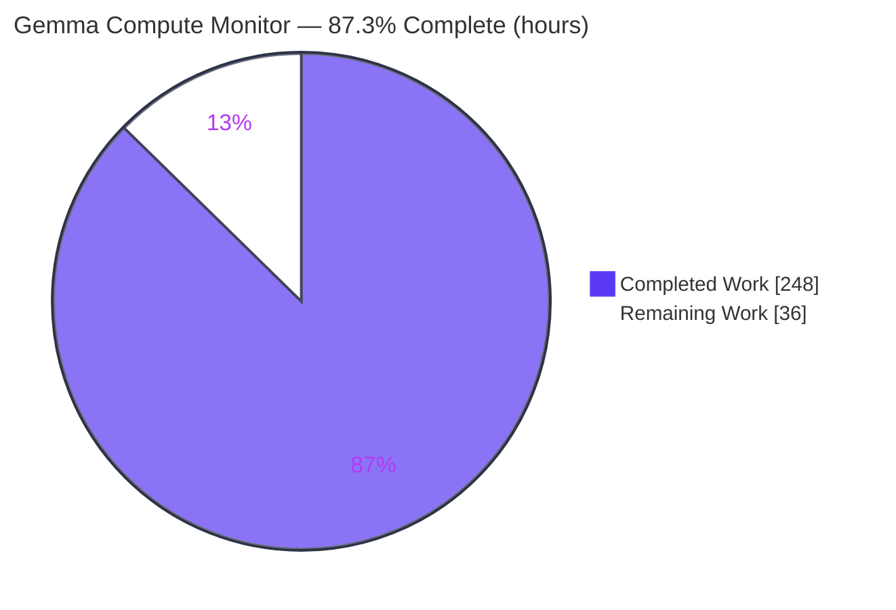
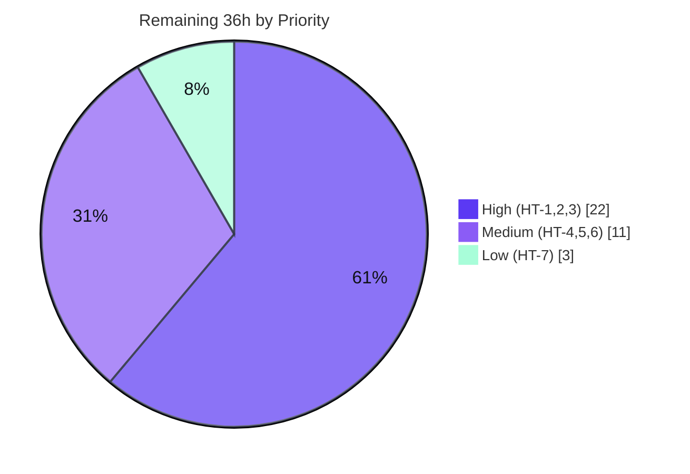

# Blitzy Project Guide — Gemma Compute Monitor

> A real-time, per-transformer-layer compute-telemetry product layered on top of the unmodified `google-deepmind/gemma` library: a local FastAPI/JAX-Metal backend that instruments the Gemma 3 4B forward pass and streams telemetry over SSE, plus a password-gated, Railway-deployed Next.js dashboard.

---

## 1. Executive Summary

### 1.1 Project Overview

The Gemma Compute Monitor is a new, self-contained observability product that visualizes the compute cost of a Gemma 3 4B inference in real time, without ever modifying the host `gemma` library. It targets ML engineers and researchers running Gemma locally on Apple Silicon who want to *see* per-layer CPU/GPU/memory behavior. The product has two independently deployed components: a **local FastAPI backend** (JAX Metal) that loads the model once at startup, instruments every transformer layer, and streams telemetry over Server-Sent Events; and a **Railway-deployed Next.js frontend** that renders four animated panels plus a per-token compute-cost strip behind a single shared-password gate. The `gemma` library is consumed strictly by composition (`from gemma import gm`) — instrumented, never reimplemented.

### 1.2 Completion Status

The completion percentage is computed using the AAP-scoped, hours-based methodology: all in-scope code deliverables are complete, compile cleanly, and pass 69/69 automated tests; the remaining hours are genuine, hardware- and credential-gated path-to-production activities that cannot be performed inside the Linux CI sandbox.



| Metric | Hours |
|---|---|
| **Total Hours** | **284** |
| **Completed Hours (AI + Manual)** | **248** |
| &nbsp;&nbsp;↳ Blitzy Autonomous (AI) | 248 |
| &nbsp;&nbsp;↳ Manual (human, pre-handoff) | 0 |
| **Remaining Hours** | **36** |
| **Percent Complete** | **87.3%** |

> **Completion formula:** `248 ÷ (248 + 36) = 248 ÷ 284 = 87.3%`. Color key: **Completed = Dark Blue `#5B39F3`**, **Remaining = White `#FFFFFF`**.

### 1.3 Key Accomplishments

- ✅ **Full backend implemented** — FastAPI app with lifespan one-time model load, `loading → ready` readiness gating, `GET /health` and `POST /analyze` (SSE) endpoints, single-flight `429` guard, explicit CORS allow-list, and security-header middleware.
- ✅ **Per-layer instrumentation harness** — eager block-by-block loop reusing the gemma `Block` submodules and weights, with a `jax.block_until_ready(x)` barrier after each layer; layer count derived **dynamically** from `config.num_layers` (= 34 for Gemma 3 4B), never hardcoded.
- ✅ **Four immutable JSON contracts** reproduced byte-for-byte in Pydantic (`schemas.py`) and TypeScript (`types.ts`).
- ✅ **Full Next.js dashboard** — password gate, four animated panels (Layer Activity bar chart, Unified Memory breakdown, GPU Utilization canvas waveform via `requestAnimationFrame`, Per-Token Cost strip), native `EventSource` client, and verbatim resilience messaging.
- ✅ **Mandated dark-only palette** — all seven colors implemented exactly in `globals.css`.
- ✅ **69/69 automated tests pass** — backend pytest 13/13 (the 7 mandated checks) + frontend jest 56/56 (5 suites). Backend pylint **10.00/10**, TypeScript `tsc --noEmit` clean, `next build` succeeds.
- ✅ **Hard constraints honored** — **zero CUDA/nvidia** anywhere in the dependency tree, `jax-metal==0.1.1` pin intact (never upgraded), and **`gemma/**` never modified** (0 files changed; reference-only).
- ✅ **Deployment artifacts + documentation** — `railway.json`, `.env.example` templates, and a comprehensive `COMPUTE_MONITOR.md` covering setup, the version-lock-sensitive install order, the per-session ngrok workflow, and troubleshooting.

### 1.4 Critical Unresolved Issues

| Issue | Impact | Owner | ETA |
|---|---|---|---|
| `jax-metal==0.1.1` / `jaxlib==0.5.0` compatibility with gemma 4.0.1's modern, unpinned JAX is unverified on real hardware | Backend may fail to import/load gemma under the Metal stack; flagged HIGH RISK in AAP §0.3.1/§0.7.2 | Backend/ML Eng | HT-1 (10h) |
| Real Gemma 3 4B forward pass never executed (no checkpoint + no Apple Silicon in sandbox) | Instrumentation harness validated only with mocks; real-weight shape/dtype/cache behavior unconfirmed | ML Eng | HT-2 (8h) |
| Live, clickable Railway URL not yet published (AAP R7 is mandatory) | Mandatory deliverable incomplete until an operator publishes with Railway credentials + a reachable backend | DevOps | HT-3 + HT-4 (8h) |

### 1.5 Access Issues

| System/Resource | Type of Access | Issue Description | Resolution Status | Owner |
|---|---|---|---|---|
| Apple Silicon Mac (M-series, macOS 14+) | Hardware | `jax-metal` / Metal `jaxlib` are macOS-arm64-only and cannot install on the Linux x86_64 sandbox; CPU-JAX 0.10.1 used as a documented validation substitute | Open — requires physical/cloud Mac hardware | Human/DevOps |
| Gemma 3 4B Orbax checkpoint (`GEMMA_WEIGHTS_PATH`) | License-gated model weights | The gated ~8.5 GB checkpoint is not present in the sandbox; the real model load / SSE token stream cannot be exercised | Open — operator must accept license & download | ML Eng |
| Railway account + deploy token | Cloud credential | Publishing the live frontend URL requires a Railway account/token not present in the repo or sandbox | Open — operator-provided | DevOps |
| `powermetrics` (macOS, root) | OS privilege | `powermetrics` is macOS-only and root-gated; on Linux `gpu_pct` correctly returns the `0.0` fallback | Open — run backend with `sudo` on macOS for real GPU data | Human |
| ngrok account/tunnel | Cloud credential | A per-session ngrok HTTPS tunnel to port 8000 is required to bridge Railway → local backend | Open — operator-provided | DevOps |

### 1.6 Recommended Next Steps

1. **[High]** Provision an Apple Silicon Mac and verify the `jax-metal==0.1.1` → `jaxlib==0.5.0` → `gemma==4.0.1` install order; confirm `from gemma import gm` imports under Metal (escalate, never upgrade `jax-metal`, if gemma needs newer JAX). *(HT-1)*
2. **[High]** Acquire the gated Gemma 3 4B checkpoint, set `GEMMA_WEIGHTS_PATH`, and run the real end-to-end model load + 34-layer SSE telemetry validation. *(HT-2)*
3. **[High]** Publish the live Railway frontend URL (set `NEXT_PUBLIC_*`, `railway up`) to satisfy the mandatory AAP R7 deliverable. *(HT-3)*
4. **[Medium]** Wire the per-session ngrok tunnel into Railway and run a full live end-to-end smoke test (auth → analyze → panels → per-token cost). *(HT-4)*
5. **[Medium]** Complete a production security review (client-side password gate, CORS lock-down to the Railway origin, ngrok exposure). *(HT-5)*

---

## 2. Project Hours Breakdown

### 2.1 Completed Work Detail

| Component | Hours | Description |
|---|---:|---|
| Backend — Model Loader & Readiness Gating | 14 | `model_loader.py` builds `gm.nn.Gemma3_4B(text_only=True)`, loads Orbax params, holds `loading → ready` flag + loaded `config`; wired into the FastAPI lifespan hook (R1) |
| Backend — Per-Layer Instrumentation Harness | 20 | `instrumentation.py` eager block-by-block loop reusing gemma `Block` modules, `jax.block_until_ready` barrier, dynamic `config.num_layers` (34) — instrument-not-reimplement (R2) |
| Backend — SSE Streaming & `/analyze` Orchestration | 14 | `sse.py` async generator → `EventSourceResponse`; blocking JAX off the event loop; final `{per_token_ms, done:true}`; client-disconnect handling (R3) |
| Backend — FastAPI App, Routes, CORS, 429/503, Security Headers | 14 | `main.py` lifespan, CORS allow-list, `503` while loading, single-flight `429` (`asyncio.Lock`), security headers, graceful load-failure |
| Backend — System Metrics & Memory Math (GQA) | 12 | `metrics.py` psutil CPU/RAM + `powermetrics` (200 ms timeout, `0.0` fallback) + KV-cache via `num_kv_heads=4` (R4) |
| Backend — Immutable Contracts & Settings | 10 | `schemas.py` (4 byte-exact Pydantic contracts), `config.py` (env contract), `__init__.py` |
| Backend — Test Suite (13 tests / 7 mandated checks) | 24 | `test_analyze.py`, `test_health.py`, `conftest.py` (JAX import safety net + fixtures) |
| Frontend — SSE Client Hook, API Helpers, Types | 22 | `useEventSource.ts` (native `EventSource`, state machine, warming-up timing), `api.ts` (health poll, resilience msgs), `types.ts` (TS contract mirrors) |
| Frontend — Dashboard Orchestration & Resilience | 12 | `Dashboard.tsx` panel composition + resilience banners; `layout.tsx`/`page.tsx` shell |
| Frontend — Four Panels + Per-Token Cost | 26 | `LayerActivityBarChart`, `MemoryBreakdown`, `GpuWaveform` (canvas + `requestAnimationFrame`), `PerTokenCost` (R5) |
| Frontend — Password Gate & Dark Palette | 11 | `PasswordGate.tsx` (`localStorage` vs `NEXT_PUBLIC_PASSWORD`, SSR-safe), `globals.css` (7-color palette, WCAG-AA contrast) (R6) |
| Frontend — Test Suite (5 suites / 56 tests) | 20 | `PasswordGate`, `Dashboard`, `panels`, `useEventSource`, `api` + jest setup/canvas mock |
| Configuration & Dependency Resolution | 12 | `requirements.txt` (version-lock pin order, no CUDA), `package.json`, `next.config.js`, `tsconfig.json`, `jest.config.js`, `railway.json`, `.env.example` ×2 |
| Documentation | 14 | `COMPUTE_MONITOR.md` (setup, ngrok workflow, troubleshooting), `backend/README.md`, `frontend/README.md` |
| Integration, QA Review-Finding Fixes & AAP Conflict Resolutions | 23 | ~10 review/QA fix commits; pylint 9.91→10.00; conflict resolutions (layer 18→34, Python ≥3.12, jax-metal/jaxlib compat, GQA head count, sync primitive); live runtime validation |
| **Total Completed** | **248** | |

### 2.2 Remaining Work Detail

| Category | Hours | Priority |
|---|---:|---|
| Apple Silicon Metal Stack Install & `jax-metal`/`jaxlib` Verification (HIGH-RISK version tension, AAP §0.7.2) | 10 | High |
| Real Gemma 3 4B Checkpoint Acquisition & End-to-End Model-Load Validation (real 34-layer forward pass + telemetry) | 8 | High |
| Live Railway Deployment — Publish Clickable URL (AAP R7, mandatory) | 4 | High |
| ngrok Tunnel Wiring & Full End-to-End Smoke Test (Railway → ngrok → local backend) | 4 | Medium |
| Production Security Review (client-side password gate, CORS lock-down, ngrok exposure) | 4 | Medium |
| Real `powermetrics` GPU Sampling Verification (macOS, root) | 3 | Medium |
| First-Run Performance Validation & Operator Runbook Dry-Run | 3 | Low |
| **Total Remaining** | **36** | |

### 2.3 Hours Reconciliation

- **Completed (Section 2.1)** = 248h &nbsp;•&nbsp; **Remaining (Section 2.2)** = 36h &nbsp;•&nbsp; **Total** = 248 + 36 = **284h**
- **Completion** = 248 ÷ 284 = **87.3%**
- Remaining hours are **identical** in Section 1.2, Section 2.2, and the Section 7 pie chart (36h). ✔
- All remaining items are path-to-production (hardware/credential-gated); **no in-scope feature code remains to be written.**

---

## 3. Test Results

All tests below originate from Blitzy's autonomous validation logs for this project and were **independently re-executed** during this assessment (backend pytest 13/13; frontend jest 56/56).

| Test Category | Framework | Total Tests | Passed | Failed | Coverage % | Notes |
|---|---|---:|---:|---:|---:|---|
| Backend — `/analyze` SSE & metrics | pytest 9.0.3 | 7 | 7 | 0 | n/a | Layer-event count == `config.num_layers` (34), 7-field immutable schema, final `{per_token_ms, done:true}`, single-flight `429`, `powermetrics` 200 ms timeout + `0.0` fallback |
| Backend — `/health` & readiness | pytest 9.0.3 | 6 | 6 | 0 | n/a | Contract shape (`ready`/`loading`), sub-500 ms response, `503` while loading, readiness transition |
| Frontend — PasswordGate | jest 30.4.2 + RTL | — | ✅ | 0 | — | Auth-gate smoke/integration (correct/incorrect password, `localStorage`) |
| Frontend — Dashboard | jest 30.4.2 + RTL | — | ✅ | 0 | — | Orchestration + resilience-banner rendering |
| Frontend — Panels | jest 30.4.2 + jest-canvas-mock | — | ✅ | 0 | — | The four telemetry panels incl. canvas `GpuWaveform` |
| Frontend — useEventSource | jest 30.4.2 | — | ✅ | 0 | — | SSE/contract handling, warming-up timing |
| Frontend — api | jest 30.4.2 | — | ✅ | 0 | — | `/health` polling + resilience messages |
| **Backend total** | pytest | **13** | **13** | **0** | — | 0.34 s |
| **Frontend total** | jest (5 suites) | **56** | **56** | **0** | — | 2.6 s |
| **GRAND TOTAL** | — | **69** | **69** | **0** | — | **100% pass; 0 skipped, 0 blocked** |

**Static analysis (from validation logs, re-verified):** backend `py_compile` clean; **pylint 10.00/10** (app/ + tests/); frontend `tsc --noEmit` exit 0; `next build` (Turbopack) succeeds (3 static pages). One benign third-party `StarletteDeprecationWarning` originates from `fastapi/testclient.py` (not project code; resolving it would require editing the out-of-scope gemma-owned root `pyproject.toml`).

---

## 4. Runtime Validation & UI Verification

Validated live in-sandbox (backend on uvicorn without real weights; frontend via `next start`). Real-weights and Metal-GPU paths are deferred to path-to-production tasks.

**Backend runtime**
- ✅ **Server boot** — uvicorn starts and stays up; lifespan kicks off the background model load.
- ✅ **Graceful load failure** — with `GEMMA_WEIGHTS_PATH` unset, the load raises a clear `RuntimeError` without crashing the server (exact readiness gating).
- ✅ **`GET /health`** — `{"status":"loading","model":"gemma-3-4b"}` in **1.4 ms** (≪ 500 ms); exact immutable contract.
- ✅ **`POST /analyze` while loading → `503`**; invalid body → **`422`**.
- ✅ **CORS** — allowed Railway origin echoed with credentials; preflight OK; disallowed origin rejected.
- ✅ **Security headers** — `nosniff`, `DENY`, `no-referrer`, `no-store`; HSTS only over HTTPS (`X-Forwarded-Proto`).
- ✅ **Metrics** — `gpu_pct()` = `0.0` (Linux fallback verified); CPU/RAM via psutil; KV-cache uses `num_kv_heads=4` (GQA) — verified numerically.
- ⚠ **Real forward pass / live SSE token stream** — not exercised (no checkpoint / no Apple Silicon). Mock-tested; deferred to HT-2.
- ⚠ **Metal GPU sampling** — `powermetrics` macOS/root-only; deferred to HT-6.

**Frontend / UI**
- ✅ **Serves HTTP 200**; PasswordGate renders with the exact mandated palette (`#0f1117`, `#1e2130`, `#f59e0b`, `#6366f1`).
- ✅ **Auth flow** — correct password unlocks the full dashboard with all panels (Layer Activity; Unified Memory 11.5/48 GB in healthy green `#10b981` with static 8.5 GB weights + 3 GB OS; GPU Utilization canvas).
- ✅ **Resilience banner** — shows the verbatim "Backend offline — start the local server and update the ngrok URL in Railway"; Analyze disabled while offline.
- ⚠ **Live deployed URL** — Railway publish + ngrok wiring deferred to HT-3/HT-4.

**API integration outcomes:** `/health` and `/analyze` (503/422 paths) ✅ operational; full live SSE stream end-to-end ⚠ pending real backend + tunnel.

---

## 5. Compliance & Quality Review

AAP deliverables cross-mapped to Blitzy quality/compliance benchmarks. Fixes applied during autonomous validation are noted; outstanding items map to Section 2.2.

| AAP Deliverable / Constraint | Status | Evidence / Progress |
|---|:--:|---|
| R1 — Startup model load + readiness gating (`503` while loading) | ✅ Pass | `model_loader.py` + `main.py` lifespan; live `/health` loading→ tested; `503` verified |
| R2 — Per-layer instrumented forward pass (dynamic layer count, instrument-only) | ✅ Pass (code) | `instrumentation.py` `range(config.num_layers)`=34, reuses `Block`, `jax.block_until_ready`; real-weight run pending (HT-2) |
| R3 — SSE telemetry streaming (`/analyze` SSE, `/health`) | ✅ Pass | `sse.py` + `EventSourceResponse`; 13/13 backend tests |
| R4 — System metrics (psutil + powermetrics 200 ms/`0.0`) | ✅ Pass (code) | `metrics.py`; fallback + timeout unit-tested; real GPU pending (HT-6) |
| R5 — Four panels + per-token cost | ✅ Pass | 4 components + `PerTokenCost`; panel tests pass |
| R6 — Single-password frontend gate | ✅ Pass | `PasswordGate.tsx`; auth tests pass |
| R7 — Live public deployment (clickable Railway URL) | ◑ Partial | `railway.json` + docs complete; build/start/auth-render verified; **live publish pending (HT-3/HT-4)** |
| Immutable 4 JSON contracts (byte-exact) | ✅ Pass | `schemas.py` + `types.ts`; schema test asserts 7 fields |
| Single-flight `429` guard | ✅ Pass | `asyncio.Lock` in `main.py`; concurrency test passes |
| CORS allow-list | ✅ Pass | `CORSMiddleware`; runtime-verified |
| Non-negotiable 7-color dark palette | ✅ Pass | `globals.css` exact; runtime-verified |
| `requestAnimationFrame` non-blocking render | ✅ Pass | `GpuWaveform.tsx` canvas + rAF |
| Verbatim resilience messaging | ✅ Pass | `api.ts` byte-exact (FINDING-1 fix) |
| **No CUDA in dependency tree** | ✅ Pass | Zero CUDA/nvidia in venv + `requirements.txt` |
| **Never upgrade `jax-metal`** | ✅ Pass | `jax-metal==0.1.1` pin intact |
| **`gemma/**` reference-only (unmodified)** | ✅ Pass | `git diff` shows 0 files changed under `gemma/` |
| Python ≥ 3.12 (conflict resolution) | ✅ Pass | Documented; venv 3.13.7; pins target 3.12 prod |
| Code quality (lint/type/build) | ✅ Pass | pylint 10.00/10; `tsc` clean; `next build` ok |
| Metal-stack runtime verification | ◑ Pending | Linux CI substitute used; real Metal verify pending (HT-1) |

**Fixes applied during autonomous validation:** byte-exact resilience message (FINDING-1); a11y contrast on the dark dashboard (FINAL-9); final-acceptance QA (3 MAJOR/5 MINOR/1 INFO); backend pylint 9.91 → 10.00 (comment/cosmetic only, tests unchanged 13/13).

---

## 6. Risk Assessment

| Risk | Category | Severity | Probability | Mitigation | Status |
|---|---|:--:|:--:|---|---|
| `jax-metal==0.1.1`/`jaxlib==0.5.0` vs gemma 4.0.1 modern unpinned JAX incompatibility | Technical | High | Med-High | Verify on real Mac; try `ENABLE_PJRT_COMPATIBILITY=1`; escalate to user, never upgrade `jax-metal` | Open (HT-1) |
| Eager harness never run against real weights — possible shape/dtype/cache mismatch | Technical | Med-High | Medium | Real-checkpoint E2E (HT-2); harness mirrors `_apply_attention` exactly | Open |
| Validation used CPU-JAX substitute, not Metal — Metal numerics/`block_until_ready` unverified | Technical | Medium | Medium | Metal verification (HT-1) | Open |
| Layer count 18 → 34 (prompt conflict) | Technical | Low | Low | Derived dynamically from `config.num_layers` + parameterized tests | Mitigated |
| Client-side password gate (`NEXT_PUBLIC_PASSWORD` inlined into JS bundle) | Security | Medium | High | By AAP design (backend auth out of scope); document, rotate, lock CORS; add backend auth if real protection needed | Accepted-by-design |
| ngrok public exposure of local backend + permissive local-dev CORS | Security | Medium | Medium | Lock prod `CORS_ALLOW_ORIGINS` to Railway origin; ephemeral tunnel; demo-only | Open (HT-5) |
| `powermetrics` root requirement → `gpu_pct` stays `0.0` without `sudo` | Operational | Low-Med | High | Graceful `0.0` fallback implemented + documented; run elevated for real data | Accepted/Documented |
| ngrok per-session URL churn → Railway env update + redeploy each restart | Operational | Low | High | Documented workflow; reserved ngrok domain (paid) for stability | Documented |
| First-run model load 20–40 s + ~8.5 GB memory blocks readiness | Operational | Low | Medium | Readiness gating + warming-up message implemented; verify real load (HT-7) | Mitigated |
| Gated Gemma 3 4B Orbax checkpoint must be operator-acquired | Integration | Medium | Medium | Documented acquisition; clear `RuntimeError` on unset path (verified) | Open (HT-2) |
| Full chain Railway → ngrok → local SSE never exercised live | Integration | Medium | Medium | Live deploy + E2E smoke (HT-3/HT-4) | Open |
| Metal stack install reproducibility on operator's exact macOS/Python 3.12 env | Integration | Medium | Medium | Documented exact pin order (HT-1) | Open |

---

## 7. Visual Project Status


**Remaining Work by Priority (hours)**



**Remaining hours per category (Section 2.2):**

| Category | Hours | Bar |
|---|---:|---|
| Metal Stack Install & jax-metal Verify | 10 | ██████████ |
| Real Checkpoint E2E Validation | 8 | ████████ |
| Live Railway Publish | 4 | ████ |
| ngrok Wiring & E2E Smoke | 4 | ████ |
| Production Security Review | 4 | ████ |
| Real powermetrics Verify | 3 | ███ |
| First-Run Perf & Runbook | 3 | ███ |
| **Total** | **36** | |

> Integrity: pie "Remaining Work" (36) = Section 1.2 Remaining (36) = Section 2.2 sum (36). ✔ Color key: **Completed = `#5B39F3`**, **Remaining = `#FFFFFF`**.

---

## 8. Summary & Recommendations

**Achievements.** The Gemma Compute Monitor is **87.3% complete** on an AAP-scoped, hours basis (248 of 284h). Every in-scope code deliverable across the FastAPI backend and the Next.js frontend is implemented, compiles cleanly (pylint 10.00/10, `tsc` clean, `next build` ok), and passes **69/69** automated tests. All hard constraints are honored: zero CUDA in the dependency tree, the `jax-metal` pin intact, the four JSON contracts byte-exact, the seven-color dark palette exact, and — critically — **the `gemma` library was never modified** (instrument-only, 0 files changed under `gemma/`).

**Remaining gaps (36h).** What remains is **not feature code** but path-to-production verification and publication that is fundamentally gated by hardware and credentials absent from the CI sandbox: (1) verifying the version-lock-sensitive Metal stack on real Apple Silicon; (2) a real-checkpoint, real-forward-pass end-to-end run confirming exactly 34 live layer events; and (3) publishing the mandatory live Railway URL and wiring the per-session ngrok tunnel.

**Critical path to production.** HT-1 (Metal verify) → HT-2 (real checkpoint E2E) → HT-3 (Railway publish) → HT-4 (ngrok + live smoke). HT-1 carries the highest technical risk (the documented jax-metal ↔ gemma JAX tension) and should be tackled first; if gemma requires a newer JAX than `jax-metal==0.1.1` supports, **escalate** rather than upgrade `jax-metal`.

**Success metrics for sign-off.** Live `/health` returns `ready` with real weights; `POST /analyze` streams exactly 34 well-formed layer events + a final per-token event; the live Railway URL renders the password gate and dashboard; GPU telemetry shows non-zero values when run with root on macOS.

**Production readiness assessment.** **Conditionally ready.** The codebase is production-grade and fully validated to the limit of a Linux sandbox; final readiness depends on the 36h of human-led, hardware/credential-gated path-to-production work above. No code rewrites are anticipated — the residual risk is integration/environment, not implementation.

---

## 9. Development Guide

### 9.1 System Prerequisites

- **macOS 14+ on Apple Silicon** (M-series; ~48 GB unified memory recommended) — required for the production `jax-metal` backend.
- **Python 3.12** (gemma requires `>=3.12`). *(Validation sandbox used 3.13.7 with CPU-JAX as a substitute.)*
- **Node.js 20 LTS** + npm (Next.js 16 requires Node 20+).
- **ngrok** CLI (HTTPS tunnel to port 8000) and a **Railway** account (frontend hosting).
- A **Gemma 3 4B Orbax checkpoint** (license-gated) for `GEMMA_WEIGHTS_PATH`.

### 9.2 Backend — Environment Setup & Install (version-lock-sensitive order)

```bash
# From the repository root
python3.12 -m venv .venv && source .venv/bin/activate

# 1) Metal backend FIRST — NEVER upgrade jax-metal without explicit approval
pip install jax-metal==0.1.1
# 2) jaxlib/jax matched to jax-metal (0.5.0 is the highest compatible; >=0.4.34 required)
pip install jaxlib==0.5.0 jax==0.5.0
# 3) Web stack
pip install fastapi==0.136.3 "uvicorn[standard]==0.49.0" sse-starlette==3.4.4 psutil==7.2.2
# 4) gemma — used AS-IS
pip install gemma==4.0.1
# (or: pip install -r backend/requirements.txt, which encodes this order)
```

### 9.3 Backend — Configure & Run

```bash
export GEMMA_WEIGHTS_PATH=/absolute/path/to/gemma3-4b      # required (Orbax checkpoint dir)
export CORS_ALLOW_ORIGINS="https://your-app.up.railway.app" # add the Railway origin
# Optional: export PORT=8000

cd backend
uvicorn app.main:app --host 0.0.0.0 --port 8000   # run from backend/ (app is a top-level package)
```

### 9.4 Frontend — Setup, Build & Run

```bash
cd frontend
npm install
# frontend/.env.local (or Railway service env):
#   NEXT_PUBLIC_API_URL=https://<your-ngrok-subdomain>.ngrok-free.app
#   NEXT_PUBLIC_PASSWORD=<your-shared-password>
npm run build
npm run start        # serves on http://localhost:3000
```

### 9.5 Per-Session ngrok + Railway Workflow

```bash
ngrok http 8000      # (a) copy the HTTPS forwarding URL
# (b) set NEXT_PUBLIC_API_URL to that URL in the Railway service env
# (c) trigger a Railway redeploy (NEXT_PUBLIC_* is inlined at build time)
```

### 9.6 Verification

```bash
# Backend health (expect {"status":"ready",...} once the model finishes loading)
curl -s http://127.0.0.1:8000/health
# Start an analysis stream (Server-Sent Events)
curl -N -X POST http://127.0.0.1:8000/analyze \
  -H 'Content-Type: application/json' -d '{"prompt":"Explain attention."}'
```

Expected: `/health` → `{"status":"ready","model":"gemma-3-4b"}`; `/analyze` → one SSE `LayerEvent` per layer (34 total) then a final `{"per_token_ms":[...],"done":true}`.

### 9.7 Run the Test Suites

```bash
# Backend (CPU JAX for tests/CI)
JAX_PLATFORMS=cpu .venv/bin/python -m pytest backend/tests/ -v     # 13 passed
# Frontend
cd frontend && CI=true npx jest --ci                              # 56 passed (5 suites)
cd frontend && npx tsc --noEmit                                   # exit 0
```

### 9.8 Troubleshooting (common error cases & resolutions)

- **`jax-metal` install / import fails** → ensure `jaxlib>=0.4.34` (we pin `0.5.0`); keep `jax`/`jaxlib` equal; try `ENABLE_PJRT_COMPATIBILITY=1`. If gemma demands a newer JAX, **escalate** — do not upgrade `jax-metal`.
- **`gpu_pct` always `0.0`** → `powermetrics` requires macOS + root; run the backend with `sudo`. On non-macOS this `0.0` fallback is expected.
- **"Backend offline — start the local server and update the ngrok URL in Railway"** → backend not reachable: start uvicorn and refresh `NEXT_PUBLIC_API_URL` in Railway, then redeploy.
- **"Model warming up, this may take 20–40 seconds on first run."** → first-run load in progress; wait for `/health` to report `ready`.
- **CORS error in the browser** → add the exact frontend origin to `CORS_ALLOW_ORIGINS` and restart the backend.
- **`RuntimeError` about `GEMMA_WEIGHTS_PATH`** → the variable is unset/invalid; point it at a real Orbax checkpoint directory.
- **Port 8000 in use** → set `PORT` (backend) or run uvicorn with a different `--port` and update `NEXT_PUBLIC_API_URL`.

---

## 10. Appendices

### Appendix A — Command Reference

| Purpose | Command |
|---|---|
| Create venv | `python3.12 -m venv .venv && source .venv/bin/activate` |
| Install backend deps (ordered) | `pip install -r backend/requirements.txt` |
| Run backend | `cd backend && uvicorn app.main:app --host 0.0.0.0 --port 8000` |
| Backend tests | `JAX_PLATFORMS=cpu .venv/bin/python -m pytest backend/tests/ -v` |
| Backend lint | `.venv/bin/python -m pylint backend/app backend/tests --rcfile=.pylintrc` |
| Install frontend deps | `cd frontend && npm install` |
| Frontend build / run | `npm run build && npm run start` |
| Frontend tests / types | `CI=true npx jest --ci` &nbsp;/&nbsp; `npx tsc --noEmit` |
| ngrok tunnel | `ngrok http 8000` |
| Health check | `curl -s http://127.0.0.1:8000/health` |

### Appendix B — Port Reference

| Service | Port | Notes |
|---|---|---|
| FastAPI backend (uvicorn) | 8000 | Override via `PORT`; ngrok tunnels this port |
| Next.js frontend (`next start`/`dev`) | 3000 | Default Next.js port |

### Appendix C — Key File Locations

| Path | Role |
|---|---|
| `backend/app/main.py` | FastAPI app: lifespan, CORS, `/health`, `/analyze`, `429`/`503`, security headers |
| `backend/app/model_loader.py` | One-time Gemma 3 4B load + `loading→ready` state |
| `backend/app/instrumentation.py` | Eager per-layer harness + `jax.block_until_ready` (dynamic 34 layers) |
| `backend/app/metrics.py` | psutil CPU/RAM + `powermetrics` GPU + KV-cache (GQA) math |
| `backend/app/sse.py` | SSE async generator → `EventSourceResponse` |
| `backend/app/schemas.py` | Pydantic models for the 4 immutable contracts |
| `backend/app/config.py` | Env-var settings (`GEMMA_WEIGHTS_PATH`, `CORS_ALLOW_ORIGINS`, `PORT`, `MODEL_ID`) |
| `frontend/components/*.tsx` | PasswordGate, Dashboard, 4 panels |
| `frontend/lib/{useEventSource,api,types}.ts` | SSE client hook, health/resilience helpers, contract mirrors |
| `frontend/app/globals.css` | Dark-only 7-color palette tokens |
| `frontend/railway.json` | Railway NIXPACKS build/deploy config |
| `COMPUTE_MONITOR.md` | Master setup / ngrok workflow / troubleshooting |
| `gemma/**` | **Reference-only** (unmodified) host library |

### Appendix D — Technology Versions

| Component | Production pin | Validation sandbox |
|---|---|---|
| Python | 3.12 | 3.13.7 |
| jax-metal | 0.1.1 (never upgrade) | n/a (macOS-arm64 only) |
| jax / jaxlib | 0.5.0 / 0.5.0 | 0.10.1 / 0.10.1 (CPU substitute) |
| fastapi | 0.136.3 | 0.136.3 |
| uvicorn[standard] | 0.49.0 | 0.49.0 |
| sse-starlette | 3.4.4 | 3.4.4 |
| psutil | 7.2.2 | 7.2.2 |
| gemma | 4.0.1 | 4.0.1 (editable) |
| Node.js | 20 LTS | — |
| next / react | ^16.2.7 / 19.2.x | 16.2.9 / 19.2.7 |
| TypeScript | 5.9.x | 5.9.3 |
| jest | 30.4.x | 30.4.2 |

### Appendix E — Environment Variable Reference

| Variable | Component | Required | Description |
|---|---|:--:|---|
| `GEMMA_WEIGHTS_PATH` | Backend | Yes | Absolute path to the Gemma 3 4B Orbax checkpoint directory |
| `CORS_ALLOW_ORIGINS` | Backend | Recommended | Comma-separated allow-list incl. the Railway origin |
| `PORT` | Backend | No | uvicorn bind port (default `8000`) |
| `MODEL_ID` | Backend | No | Model identifier; defaults to immutable `gemma-3-4b` |
| `NEXT_PUBLIC_API_URL` | Frontend | Yes | Backend base URL (ngrok HTTPS); inlined at build time |
| `NEXT_PUBLIC_PASSWORD` | Frontend | Yes | Shared-access gate value; inlined at build time (not secret) |

### Appendix F — Developer Tools Guide

- **pytest** — backend unit/contract tests (`JAX_PLATFORMS=cpu` for CI).
- **pylint** (`.pylintrc`) — backend lint; current score **10.00/10**.
- **jest + React Testing Library + jest-canvas-mock + jsdom** — frontend tests incl. canvas panel.
- **tsc** (`--noEmit`) — strict TypeScript type checking.
- **next build** (Turbopack) — production frontend build.
- **uvicorn** — ASGI server for local backend.
- **ngrok** — per-session HTTPS tunnel to the local backend.
- **Railway CLI** (`railway up`) — frontend deploy/publish.

### Appendix G — Glossary

| Term | Meaning |
|---|---|
| **SSE** | Server-Sent Events — one-way server→client streaming used by `/analyze` |
| **GQA** | Grouped-Query Attention — Gemma 3 4B uses `num_kv_heads=4` (not `num_heads=8`) for KV-cache sizing |
| **Layer event** | One telemetry JSON emitted after each transformer layer's device compute is synchronized (34 total) |
| **Readiness gating** | The `loading → ready` flag that makes `/analyze` return `503` until the model is loaded |
| **Single-flight guard** | An `asyncio.Lock` ensuring only one `/analyze` runs at a time (`429` otherwise) |
| **`block_until_ready`** | JAX barrier that waits for an array's device computation to finish before sampling host metrics |
| **Orbax** | The checkpoint format/loader used by gemma for model parameters |
| **Path-to-production** | Deployment/verification work required to ship beyond writing feature code |